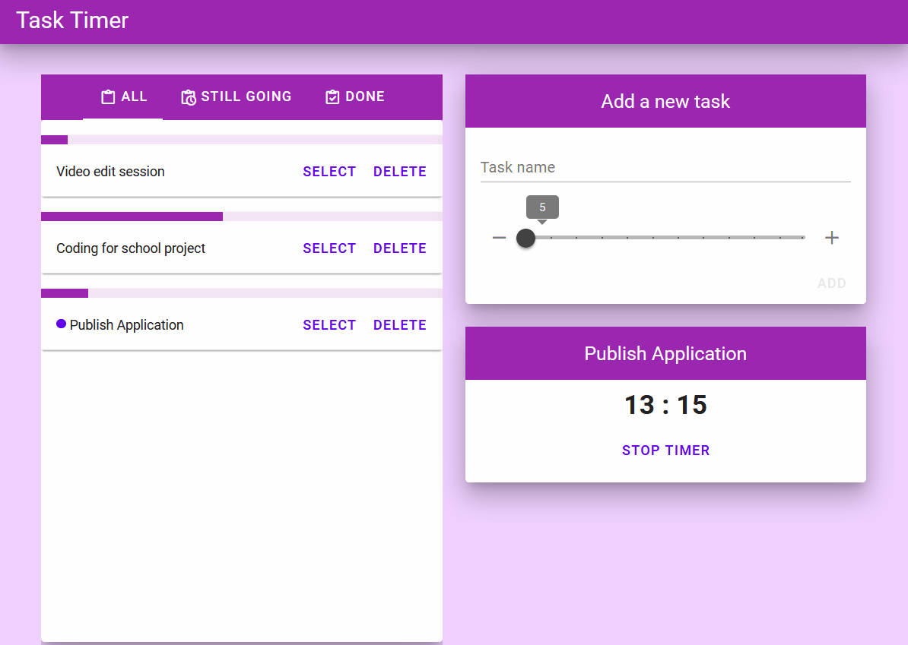

# Task Timer

This is a web application made with Vue 3 and Vuetify. The application lets users time their daily tasks and keep track of them. 
Tech: Vue 3 | Vuetify | HTML | JavaScript | Netlify 

You can test the application live here : https://deft-gecko-82dda2.netlify.app/
| Create Post                            | Browse & Search Posts                          |
| -------------------------------------- | ------------------------------------------------ |
|  |  |
## Recommended IDE Setup

[VSCode](https://code.visualstudio.com/) + [Volar](https://marketplace.visualstudio.com/items?itemName=johnsoncodehk.volar) (and disable Vetur) + [TypeScript Vue Plugin (Volar)](https://marketplace.visualstudio.com/items?itemName=johnsoncodehk.vscode-typescript-vue-plugin).

## Customize configuration

See [Vite Configuration Reference](https://vitejs.dev/config/).

## Project Setup

```sh
npm install
```

### Compile and Hot-Reload for Development

```sh
npm run dev
```

### Compile and Minify for Production

```sh
npm run build
```
